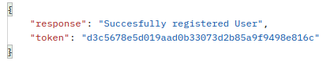

# IamDB API Documentation

## 1. Recommended System Configurations

> - BEFORE USING ACTIVATE VENV
> - UBUNTU PREFERRED
>> - _Because submitted project uses Ubuntu based Virtual Environment._
> ### Configurations for different OS
>> - _Create a Virtual Environment_
>> - _Install Requirements.txt_
>> - _You're good to go._
> ### Important Informations
>> - _A valid token is "8c84460c59e563ef525b49852dffa0034f84ef36" but Do not signout from "saurabh"._
>> - _You can signout from "saurabh11", "saurabh23", "saurabh90"._
>> - _While using Test cases delete scenerio is implemented and reason is metioned there_

> ### Some Features from my side
>> - _Search doesn't rely on parameter, any similar(not exact) match will be displayed._
>> - _Without Tokens you can't access any feature except sampleAPI._
>> - _Tokens will only be generated while signUP and signIN._
>> - _After signOUT respective Token will be destroyed, so they can be used again only after new signIN._
>> - _All the relevant HHTP status code will be sent automatically from server(200 OK, 400 Bad Request, 409 Data Conflict, 401 Unauthorized etc.)_


### 2. IamDB app URL Structure

| Service Name | API | Methods Allowed | Return |
| ------- | ------- | ----- | --- |
| Sample API | http://127.0.0.1:8000/app/sample | GET | HTTPResponse |
| New User/Sign UP | http://127.0.0.1:8000/app/signup | POST | JSON |
| Sign IN | http://127.0.0.1:8000/app/signin | POST | JSON |
| Fetch All | http://127.0.0.1:8000/app/fetch_all | POST | JSON |
| Search | http://127.0.0.1:8000/app/Search | POST | JSON |
| Update | http://127.0.0.1:8000/app/update | PATCH | JSON |
| Delete | http://127.0.0.1:8000/app/delete | DELETE | JSON |

### 3. Utility URL Structure

| Service Name | API | Methods Allowed | Return |
| ------- | ------- | ----- | --- |
| Admin | http://127.0.0.1:8000/superuser | GET | Webpage |
| Default JSON Loader | http://127.0.0.1:8000/load_db/default | GET | mssg "Sample Database Creation Successful" |

### 6. DATABASE Model Structure

> - Special case is in GENRE because it contains list field So to handle that JsonField is used.
>
> - 99popularity is named as _99popularity because of variable naming convention.


### 5. API usage

> ####Sample API
> ```
> Hit 
>   http://127.0.0.1:8000/app/sample
> with GET method
> ```
> - SAMPLE OUTPUT


> ####Sign UP or New User
> ```
> Hit 
>   http://127.0.0.1:8000/app/signup
> with POST method
> {
>   "username": "<sample_username>",
>   "password": "<sample_password>",
>   "email": "<sample@email.com>"
> }
> ```
> - SAMPLE OUTPUT




> ####Sign IN
> ```
> Hit 
>   http://127.0.0.1:8000/app/signin
> with POST method
> {
>   "username": "<sample_username>",
>   "password": "<sample_password>"
> }
> ```
> - SAMPLE OUTPUT
> 


#### _NOTE : Session Management through token authentication implemented._

> ####Search
> ```
> Hit 
>   http://127.0.0.1:8000/app/search
> with POST method
> {
>   "search-key": "<Any keyword like 'charlies'>",
>   "token": "<Valid token>"
> }
> ```
> - SAMPLE OUTPUT
> 


#### _NOTE : Case sensitiveness (Uppercase and Lowercase) of search parameter handled, keyword will be searched in every attribute of 'DATABASE'._

> ####Update
> ```
> Hit 
>   http://127.0.0.1:8000/app/update
> with PATCH method
> {
>    "parameter":"director",
>    "key": "<director's name>",
>    "data": {
>        "movie-name":"<new movie-name>"
>    },
>    "token": "<Valid Token>"
> }
> ```
> - SAMPLE OUTPUT
>


#### _NOTE : Handled invalid parameter passing, Also only provided details will be updated._

> ####Delete
> ```
> Hit 
>   http://127.0.0.1:8000/app/delete
> with DELETE method
> {
>    "parameter":"director",
>    "key": "<director's name>",
>    "token": "<Valid Token>"
> }
> ```
> - SAMPLE OUTPUT
>


#### _NOTE : All records that contain similar string in it according to parameter passed will be deleted._

> ####SignOUT
> ```
> Hit 
>   http://127.0.0.1:8000/app/delete
> with POST method
> {
>    "token": "<Valid Token>"
> }
> ```
> - SAMPLE OUTPUT
>


#### _NOTE : All records that contain similar string in it according to parameter passed will be deleted._

> ####Fetch All
> ```
> Hit 
>   http://127.0.0.1:8000/app/fetch_all
> with POST method
> {
>   "token": "<valid Token>"
> }
> ```
> - SAMPLE OUTPUT
>


> ###NOTE
>> - #### Only Superusers can login using API.

